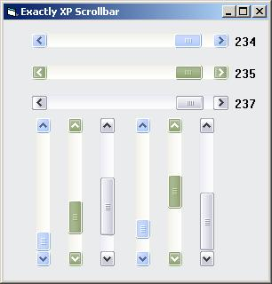



## Exactly XP Scrollbar

### Description

Scrollbar with XP style. Support for Windows Xp Color scheme: Blue, Olive Green and Silver.

The usercontrol prepared to replace standard scrollbar with custom scrollbar with XP style.

I hope this controls usefull for your application.
 
### More Info
 

             |
---                |---
**Submitted On**   |2005-05-16 08:43:06
**By**             |[devilito](https://github.com/Planet-Source-Code/PSCIndex/blob/master/ByAuthor/devilito.md)
**Level**          |Advanced
**User Rating**    |4.7 (28 globes from 6 users)
**Compatibility**  |VB 5\.0, VB 6\.0
**Category**       |[Custom Controls/ Forms/  Menus](https://github.com/Planet-Source-Code/PSCIndex/blob/master/ByCategory/custom-controls-forms-menus__1-4.md)
**World**          |[Visual Basic](https://github.com/Planet-Source-Code/PSCIndex/blob/master/ByWorld/visual-basic.md)
**Archive File**   |[Exactly\_XP1888715162005\.zip](https://github.com/Planet-Source-Code/devilito-exactly-xp-scrollbar__1-60550/archive/master.zip)

